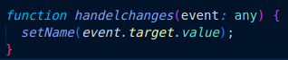
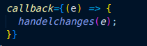
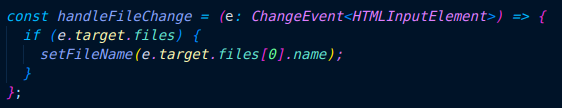
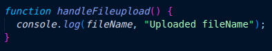
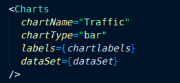

# Getting Started with Create React App

This project was bootstrapped with [Create React App](https://github.com/facebook/create-react-app).

## Available Scripts

Once you clone this repo first run:

### `npm Install `

or

### `yarn Install`

Once installation is completed we need to start running our application for that we need to run

### `npm start`

or

### `yarn Start`

It runs the app in development mode.\
Open [http://localhost:3003](http://localhost:3003) to view it in the browser.

The page will reload if you make edits.\
You will also see any lint errors in the console.

**In this Application, we have reusable components!**

1. `Input Fields`
2. `File uploader`
3. `Grid`
4. `Chart`

### 1. Input Fields

To use the Input Fields first we need to Import the Components and we need to pass the Props.\
Props:

1. `callback` - we need to pass the handle change function to get the entered value by the user.\
   Declared function.\
     .\
    passing function as props.\
    
2. `type` - we need to pass the TYPE for the field in that we can specify whether it is text, email, or password filed
3. `Name` - the name is for the label of the particular input field
4. `errorMessage` - The errorMessage is for validating the form and to display the customised error message
### 2. File uploader

To use the File uploader first we need to Import the Components and we need to pass the Props to it

#### Props

1. `callback` - we need to pass the function of the file upload to get the file data and details
   
2. `callback 2` - we need to pass the function to handle the upload button (for API calls)
   

### 3. Grid

To use the Grid first we need to Import the Components and we need to pass the Props to it

#### Props

1. `Data set` - we need to pass data that we wanted to be in the grid (it may be image, text, form and etc.)

### 3. Chart

To use the Chart first we need to Import the Components and we need to pass the Props to it

#### Props

1. `ChartType` - we need to pass Chart type (whether it may be Bar chart, Line chart, Pie chart, Radar chart,)
2. `Labels` - a label will be the name of the x-axis data
3. `ChartName` - will the name of the chart
4. `DataSet` - The Dataset will be the value for the chart.\
   

### `npm test `

Launches the test runner in the interactive watch mode.\
See the section about [running tests](https://facebook.github.io/create-react-app/docs/running-tests) for more information.

### `npm run build`

Builds the app for production to the `build` folder.\
It correctly bundles React in production mode and optimizes the build for the best performance.

The build is minified and the filenames include the hashes.\
Your app is ready to be deployed!

See the section about [deployment](https://facebook.github.io/create-react-app/docs/deployment) for more information.

### `npm run eject`

**Note: this is a one-way operation. Once you `eject`, you can’t go back!**

If you aren’t satisfied with the build tool and configuration choices, you can `eject` at any time. This command will remove the single build dependency from your project.

Instead, it will copy all the configuration files and the transitive dependencies (webpack, Babel, ESLint, etc) right into your project so you have full control over them. All of the commands except `eject` will still work, but they will point to the copied scripts so you can tweak them. At this point you’re on your own.

You don’t have to ever use `eject`. The curated feature set is suitable for small and middle deployments, and you shouldn’t feel obligated to use this feature. However we understand that this tool wouldn’t be useful if you couldn’t customize it when you are ready for it.

## Learn More

You can learn more in the [Create React App documentation](https://facebook.github.io/create-react-app/docs/getting-started).

To learn React, check out the [React documentation](https://reactjs.org/).
